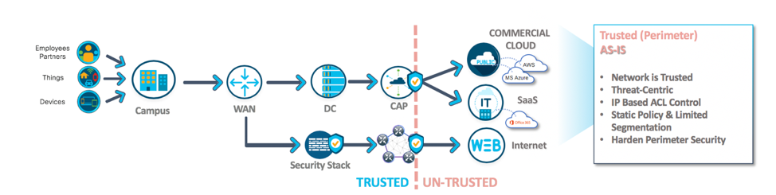
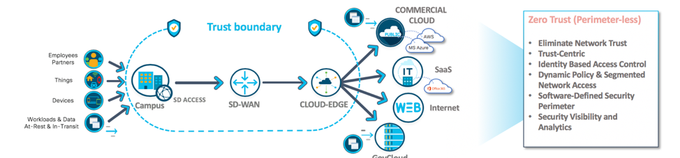

# Zero-Trust Network (ZTN)

trusted network architecture

untrusted network architecture

Simple philosophy at the core of Zero Trust: 
* Security professionals must stop trusting packets as if they were people. 
* Eliminate the idea of a trusted network (internal network) and an untrusted network (external networks). 

In Zero Trust, all network traffic is untrusted:
* verify and secure all resources
* limit and strictly enforce access control
* and inspect and log all network traffic

Trust is the fundamental problem in information security today.

change the trust model:
* we can change our networks and make them easier to build and maintain;
* we can even make them more efficient, more compliant, and more cost-effective. 

# core concepts of Zero Trust:
1) There are no longer a trusted and an untrusted interface on our security devices; 
2) there are no longer a trusted and an untrusted network;
3) there are no longer trusted and untrusted users;

# legacy networks
* more concerned with infrastructure than with data
* start at the router (complex routing protocols), at the end plug in resources into the network (little regard to potential security implications)
* build networks from the outside in: built the network pipe first and then invited everyone to build destinations second.

# future networks
e.g.: How Bugsy Siegel build Las Vegas - build the town first and the road second.
build networks from the inside out:
* protect the data first (processes and compliance)
* build network seconds
=> Building roads is easy. Security is hard.

source:
http://www.virtualstarmedia.com/downloads/Forrester_zero_trust_DNA.pdf