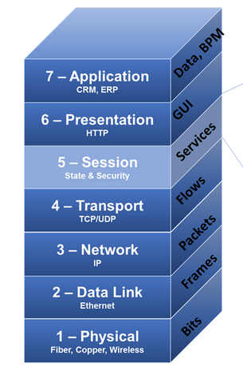
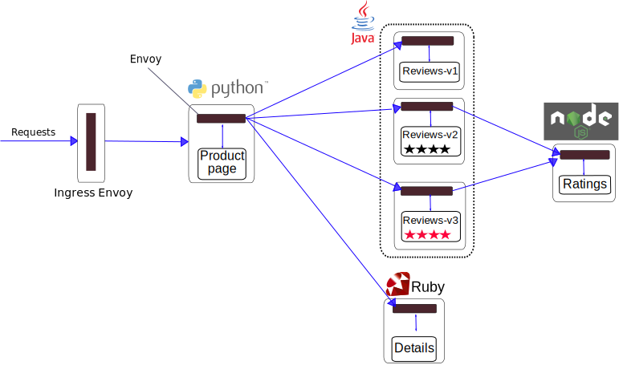

# Using Network Policy with Istio



Network Policy 
* operates at Layers 3 (Network) and 4 (Transport) in the OSI model.
* advantage: universal (all network applications use IP)
* implemented in kernel space: fast

Istio policy 
* operates at  Layer 7 (Application) the “service” layer of your network application
* advantage: apply policy based on virtual host, URL, HTTP headers (not available on Level 3 and 4)
* implemented in user space: flexibility

Istio Implementation:
* sidecar container (Envoy proxy)




# Reduce attack surface of the application ingress
istio.yaml - ingress controller, application's entry point
```
apiVersion: v1
kind: Service
metadata:
  name: istio-ingress
  labels:
    istio: ingress
spec:
  type: LoadBalancer
  ports:
  - port: 80
    name: http
  - port: 443
    name: https
  selector:
    istio: ingress
```


limit incoming traffic to just two ports (80, 443):
```
apiVersion: networking.k8s.io/v1
kind: NetworkPolicy
metadata:
  name: istio-ingress-lockdown
  namespace: default
spec:
  podSelector:
    matchLabels:
      istio: ingress
  ingress:
  - ports:
    - protocol: TCP
      port: 80
    - protocol: TCP
      port: 443
```

# Enforce fine-grained isolation within the application

ingress is compromise:
* attacker has only access to "Product Page"-Pods

```
apiVersion: networking.k8s.io/v1
kind: NetworkPolicy
metadata:
  name: product-page-ingress
  namespace: default
spec:
  podSelector:
    matchLabels:
      app: productpage
  ingress:
  - ports:
    - protocol: TCP
      port: 9080
    from:
    - podSelector:
        matchLabels:
          istio: ingress
```

source:
https://istio.io/blog/2017/0.1-using-network-policy/
