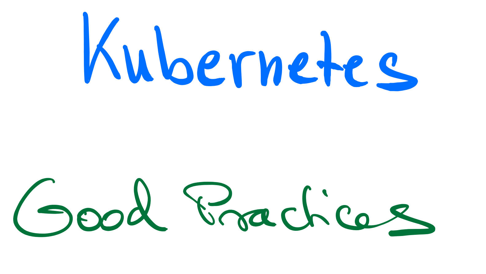
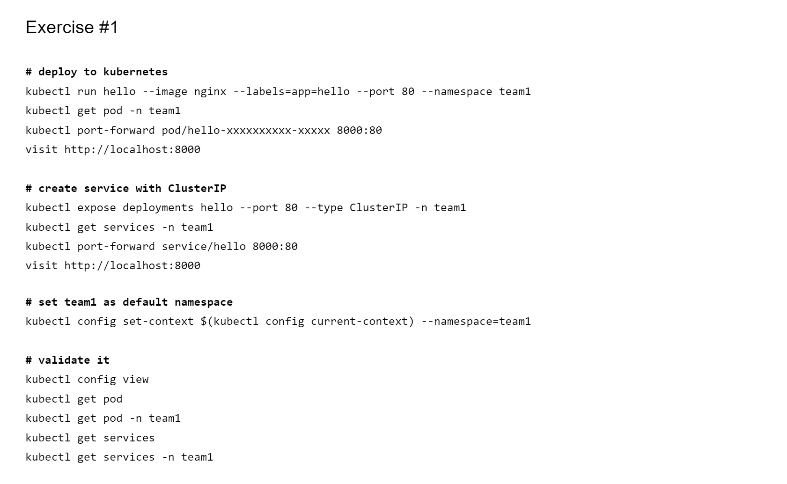
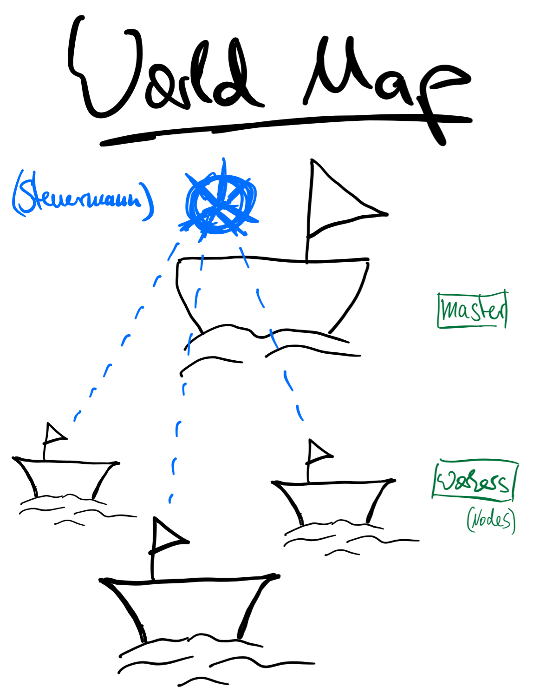

# Kubernetes Workshop

**Target Audience:** DevOps - Developers & Operations

**Description:** Kubernetes Best Practices with a focus on DevOps, Monitoring, Scaling, Volumes, Security, Mesh

## High Level Concepts as guiding principles

* Kubernetes Architecture
* What is Good Cloud Native Citizen?
* Structural Patterns: init container, sidecar container
* DevOps: Push vs Pull
* SecOps: overview and good practices

## Demonstrations

* DevOps pipeline workflow
* Azure Monitoring
* Scaling (Pod and Cluster)
* Networking (Ingress)

## Hands-On Exercise

This workshop also includes a hands-on exercise with the participants, featuring:

* kubectl
* imperative commands vs delarative manifests
* create pods, services
* ingress with external dns
* Horizontal Pod Autoscaling

For more details on the Hands-On exercise Workbook go here: [more details](./docs/hands-on)

